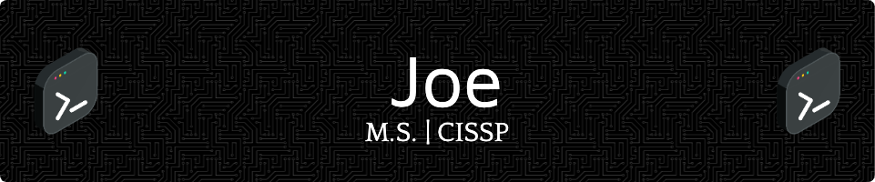

# Hey there! 👋

I'm Joe, a cyber professional and tech-savant. Welcome to my GitHub Universe! 🚀

## 🌟 About Me

- 🎓 Graduated with a degree in Technology Management from Florida Tech.
- 🎓 Completed the Galvanize Full-Stack Software Developer CodeCamp
- 💼 Currently rocking it as a Full-Stack Developer in the Defense Industry.
- 💻 Passionate about cybersecurity, software engineering, and cloud solutions.
- 🌱 Always learning and exploring new technologies such as Kubernetes, AWS, Google Cloud, and open.ai 

## 💡 Skills

- **Languages:** HTML, CSS, Javascript, Typescript, Python, Java, SQL
- **Web_Dev:** Node.JS, REACT, Express, NEXT.js, Tailwind CSS, Vite, Vue
- **Databases:** PostgreSQL, DynamoDB, pgAdmin, MongoDB
- **Dev_Tools:** Docker, Kubernetes, VSCode, Grafana, GitLab, Postman, JIRA, npm, Vim, Nano, Slack
- **Cloud:** AWS & GCP
- **Cyber_Tools:** Nmap, Metasploit, WireShark, Nessus, Snort, OWASP, OpenCTI, MISP
- **Forensics:** Autopsy, TSK, dd, Volatility, EnCase

	<code></code>
	<code></code>
	<code></code>
	<code></code>
	<code></code>
	<code></code>
	<code></code>
	<code></code>
	<code></code>
	<code></code>
	<code></code>
	<code></code>
	<code></code>
	<code></code>
	<code></code>
	<code></code>
	<code></code>
	<code></code>
	<code></code>
	<code></code>
	<code></code>
	<code></code>
	<code></code>
	<code></code>
	<code></code>
	<code></code>
	<code></code>
	<code></code>
	<code></code>
	<code></code>
	<code></code>
	<code></code>
	<code></code>
	<code></code>
	<code></code>
	<code></code>
	<code></code>

## 🚀 Projects

# Here are some cool projects I've been working on:

1. [Google Review Scraper](https://github.com/farrell-j/Google_Review_Scraper)
2. [SDI Captstone](https://github.com/farrell-j/Capstone-Project)
3. [Z-Prefix-App](https://github.com/farrell-j/z-prefix-app)
4. [Cosmos-Web](https://github.com/hsfl/cosmos-web)

#Check out more of my projects on [GitHub](https://github.com/farrell-j?tab=repositories)!

## 📫 Let's Connect

- [LinkedIn](https://www.linkedin.com/in/joseph-a-farrell-913924117/)
- [Email](mailto:farrell.j@protonmail.com?)

# Let's chat! Feel free to reach out. 📩

# Thanks for dropping by! 🌟

<!--
**farrell-j/farrell-j** is a ✨ _special_ ✨ repository because its `README.md` (this file) appears on your GitHub profile.

Here are some ideas to get you started:

- 🔭 I’m currently working on ...
- 🌱 I’m currently learning ...
- 👯 I’m looking to collaborate on ...
- 🤔 I’m looking for help with ...
- 💬 Ask me about ...
- 📫 How to reach me: ...
- 😄 Pronouns: ...
- ⚡ Fun fact: ...
-->
